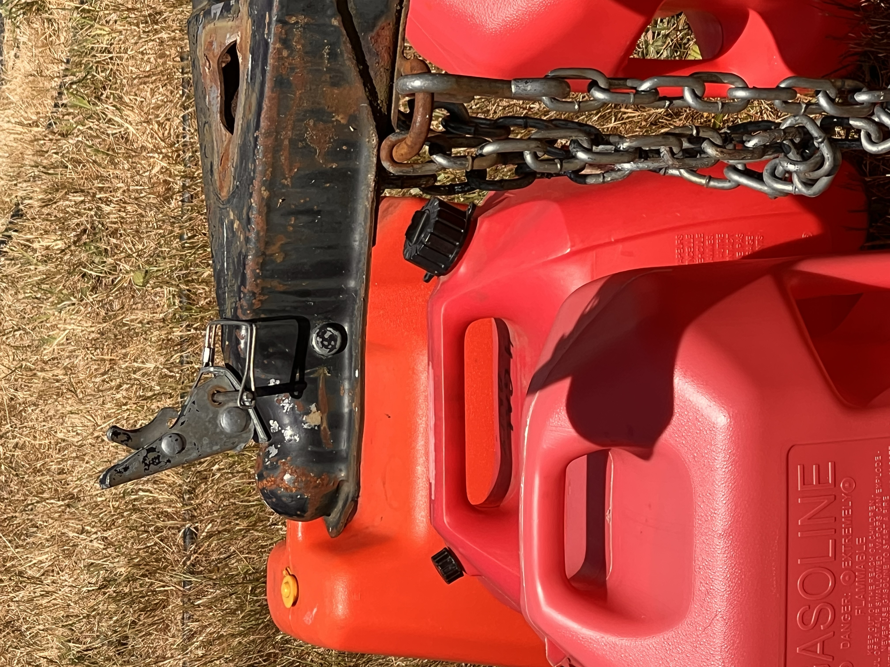
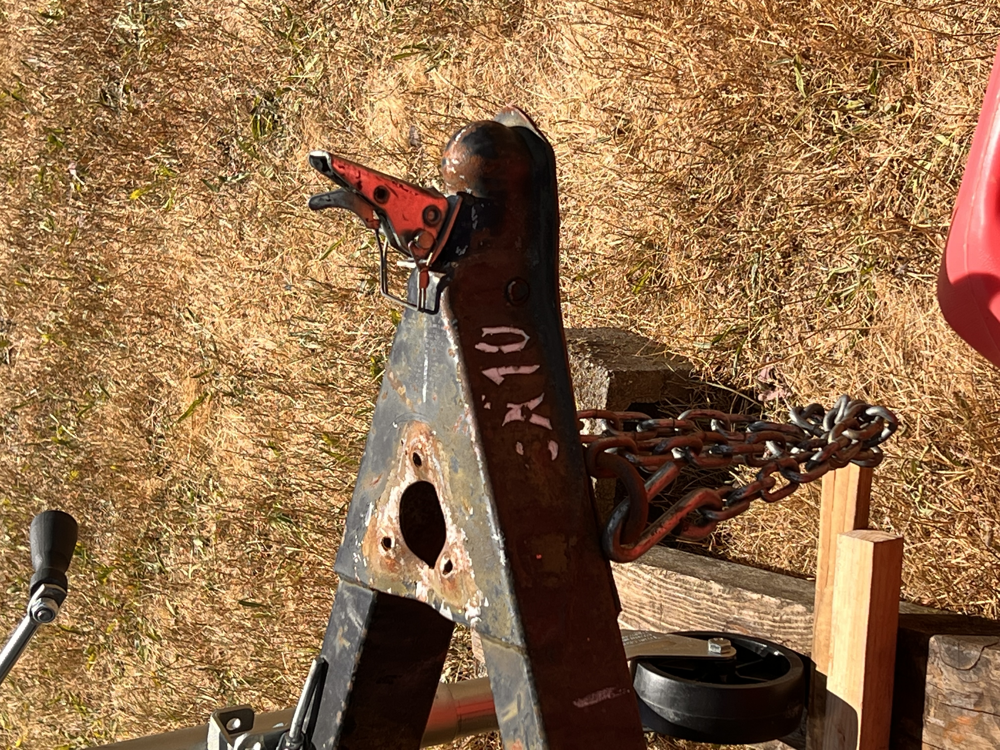
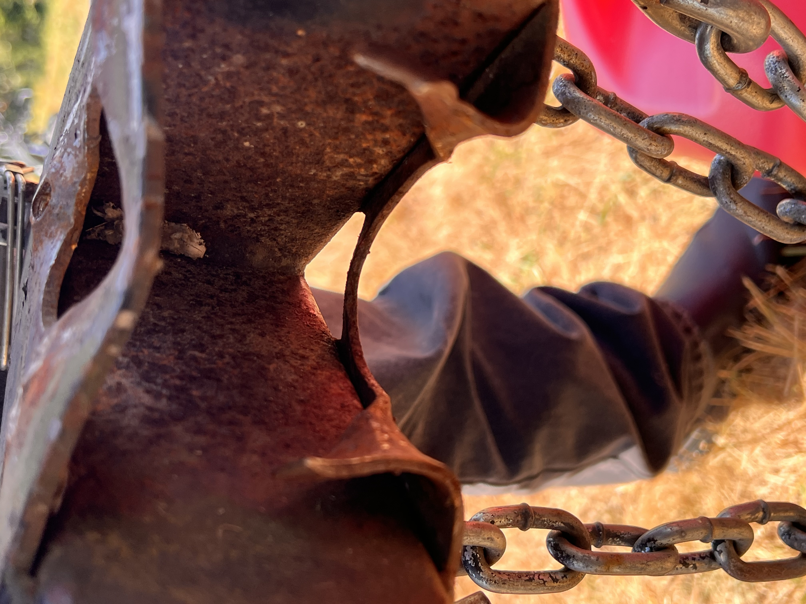
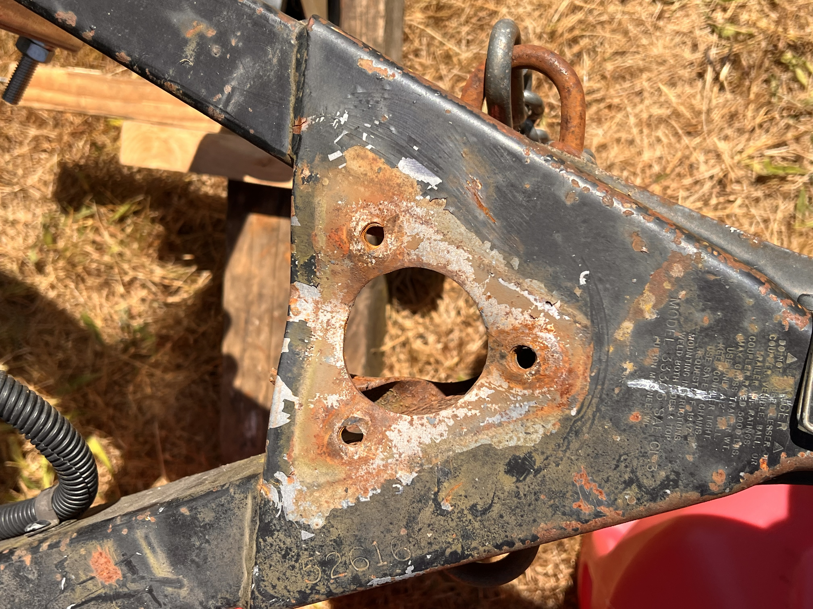
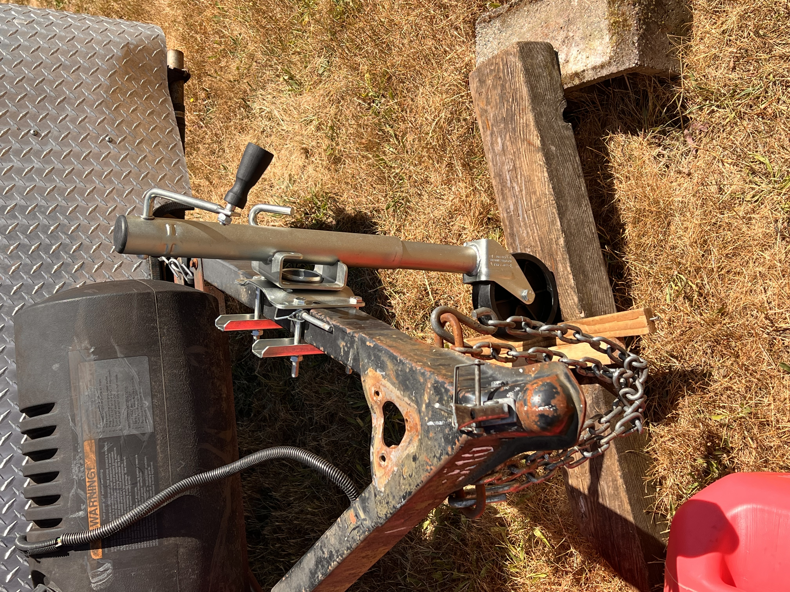
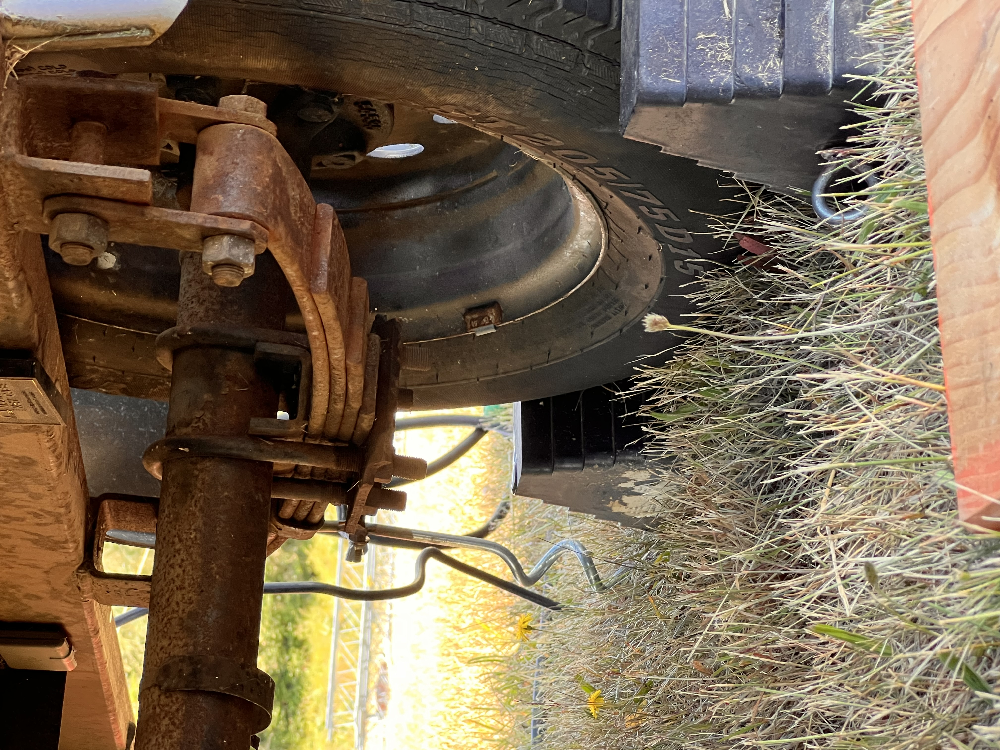
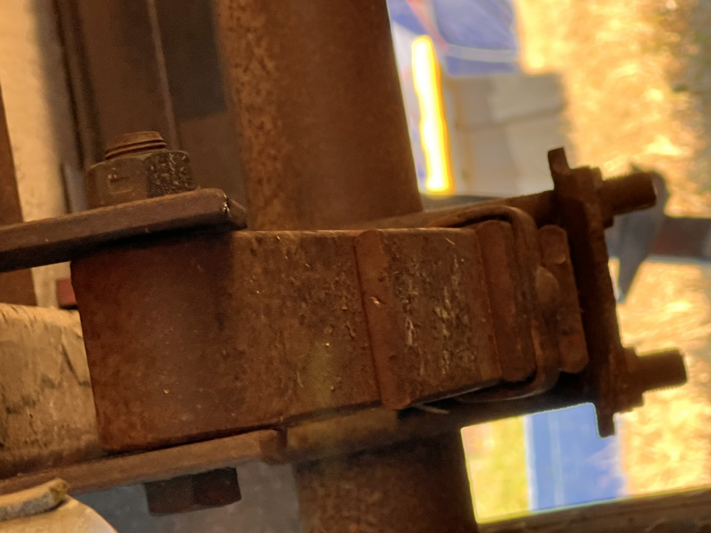
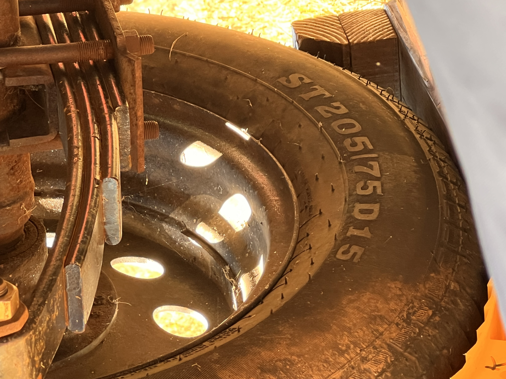
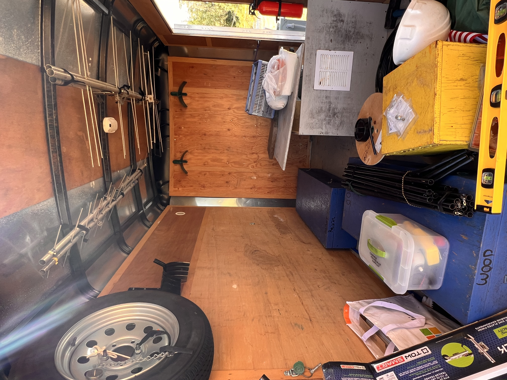
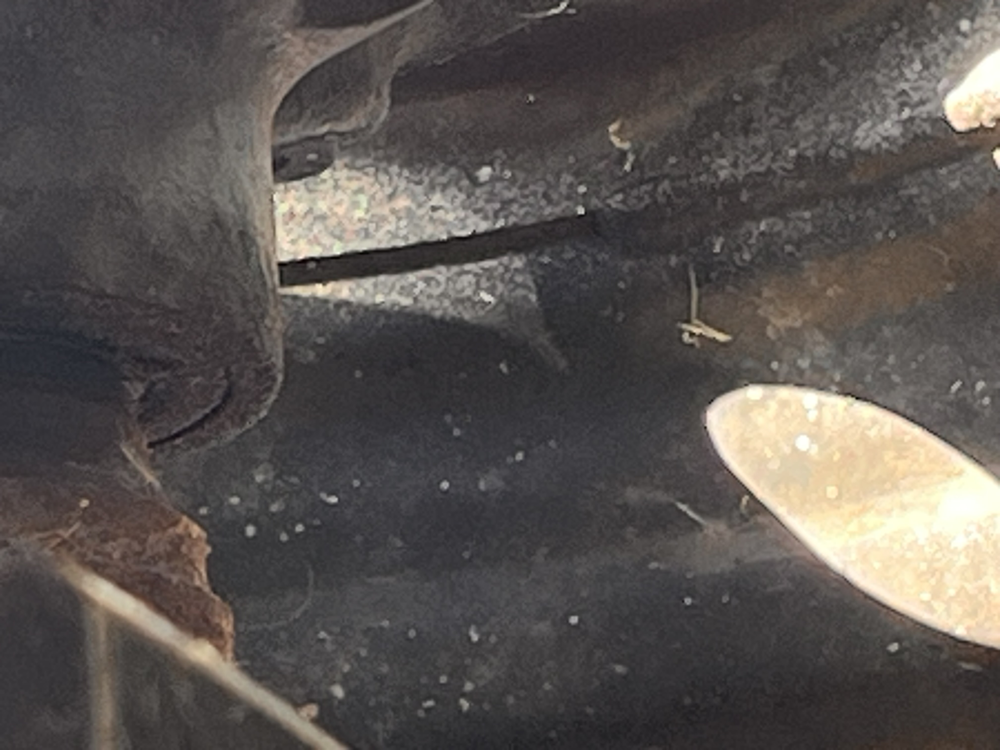

# Equipment Trailer — FD 2026 After Action Report

**Source:** M&K Field Day 2026 After Action Discussion — Zoom Meeting Closed Caption Transcript  
**Segment:** 10:35:10 – 10:46:30  
**Reporter:** Tom Sayles (KE4HET)  
**Full AAR:** [tsayles/field-day-2027 — aar-mk-2026-field-day-discussion.md](https://github.com/tsayles/field-day-2027/blob/main/docs/debrief/aar-mk-2026-field-day-discussion.md)

---

## SR-167 Trailer Separation Incident

Tom reported on the equipment trailer transport incident that occurred on the way to Fort Flagler:

- Departed from Toku's (AD7JA) Skyway Radio & TV Service shop Thursday morning of Field Day week.
- On State Route 167 through Kent, hit a large bump; the trailer was already bouncy and squirrelly (swaying).
- The trailer **popped off the hitch**, landed on the trailer jack, and dragged by the safety chains until he could pull to the shoulder.
- Attempted to jack the tongue back up but remained ~3 inches short of reaching the ball.
- Called **U.S. Rider** (AAA equivalent for the equestrian community) — a tow truck arrived in ~30 minutes.
- The tow truck towed the trailer off the freeway to a nearby parking lot. The driver then positioned his truck perpendicular to the trailer tongue and used the boom/hoist to lift the tongue high enough for Tom to back his truck underneath; re-hitched successfully.
- The **trailer jack was destroyed**; the hitch plate on the trailer was bent.

> *"The crew out at Fort Flagler jumped in like a NASCAR pit crew"* — installed a bolt-on replacement jack (~$50 from Walmart in Federal Way).

- Dean (N7XS) later removed the broken jack and pounded the hitch plate back to a more normal configuration.

---

## Contributing Factors

### Cargo Weight Distribution
- Upon opening the trailer Friday, it was discovered **all cargo weight was sitting on or behind the axle** — this explains the squirrelly handling.
- On Sunday pack-out, Tom personally re-loaded the trailer with weight shifted **well forward of the axle**. Handling improved but remained bouncy.
- **Implication:** Proper weight distribution (well forward of axle) is a loading requirement that must be documented and enforced.

### Suspension Spring
- A spring was replaced last year after rusting through.
- There is **uncertainty whether the replacement spring is the correct specification** for this trailer, which may also be contributing to handling problems.
- → See [Issue #6](https://github.com/tsayles/mk-equip-trailer/issues/6)

---

## Damage Photos

*Photo credit: Robert (KJ7CBO).*

---

## Action Items

| # | Action | Owner | Status | Issue |
|---|--------|-------|--------|-------|
| 1 | Inspect hitch plate — grind off damaged plate and weld in a new one | Board / trailer maintenance team | Open | [#5](https://github.com/tsayles/mk-equip-trailer/issues/5) |
| 2 | Verify suspension spring is correct spec — replace if mismatched | Board / trailer maintenance team | Open | [#6](https://github.com/tsayles/mk-equip-trailer/issues/6) |
| 3 | Document weight distribution requirements — establish and enforce forward-of-axle loading standard | | Open | |

---

## Epilog — Post-Field-Day Follow-up (2026-08 through 2026-09-08)

### Weight Analysis

After Field Day, Tom (KE4HET) weighed the trailer setup and confirmed the overloading:

| | Weight |
|---|---|
| Trailer + generator (empty) | ~1,740 lbs |
| Cargo (as loaded for FD 2026) | ~2,020 lbs |
| **Total** | **~3,760 lbs** |
| **Overload** | **~1,000 lbs** |

> *"We have definitely been overloading the trailer by about 1000 lbs."*  
> — Tom Sayles, KE4HET (2026-09-02)

Robert Christian noted that even removing the few items that *could* come out still left the trailer overweight, and raised the possibility that a tandem-axle trailer may ultimately be needed. *(2026-09-02 board discussion)*

### Weight Reduction Test

When approximately half the cargo weight was removed from the trailer — enough to eliminate the overloading — the trailer towed significantly better. This confirms the overloading as the primary cause of the handling problems observed on SR-167.

> ⚠️ **The trailer must NOT be towed with its current full cargo load.** Equipment must be removed to eliminate the overloading and to ensure weight is properly distributed forward of the axle before any tow.

### Generator Service

Following Field Day, the permanently-mounted Honda EV6010 generator (S/N ECB-1021107) was sent to **Bryant's Tractor & Mower Inc.** (Renton, WA) for a full service. The trailer was ready for pickup on **2026-09-04**. See [Issue #8](https://github.com/tsayles/mk-equip-trailer/issues/8) for full service details (Invoice #346261, $368.22, paid in full).

### Return to Storage

Tom recommended against reloading the full cargo before returning the trailer, given the confirmed ~1,000 lb overload. He also recommended that someone record an inventory of the Auburn storage unit contents when loading out — to support decisions about what should be in the trailer, what can be stored elsewhere, and what should be disposed of.

The trailer and all equipment were returned to **Toku's (AD7JA) yard on 2026-09-08**.
